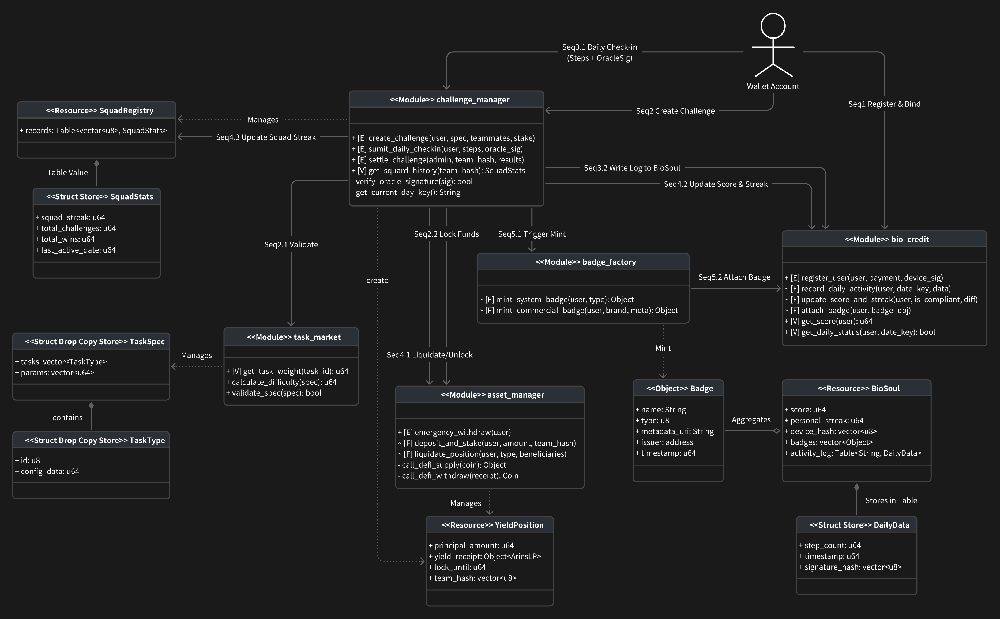
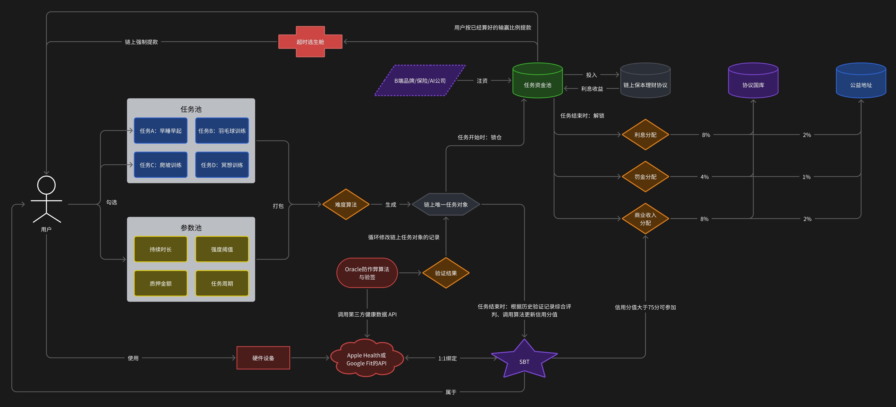

# Protocol 75 (v0.1.1)

Protocol 75 is a "Web3 Human Self-Discipline Credit Protocol" built on the Aptos blockchain. It leverages the immutability of blockchain and the automated execution of smart contracts to transform non-standard personal self-discipline behaviors (such as exercise, sleep, and routines) into quantifiable on-chain credit assets (Bio-Credit). Moving away from traditional GameFi Ponzi models, the project builds a "Stake-Verify-Settle" positive incentive loop based on the "loss aversion" principle of behavioral economics.

## Development

### Smart Contract Architecture

The project adopts a **Manager-Storage** architecture, containing the following core modules:

- **challenge_manager**: Core business logic, responsible for coordinating challenge creation, fund locking, daily check-ins, and settlement.
- **bio_credit**: User identity layer (Storage), manages BioSoul (SBT), personal streak records, and badge mounting.
- **asset_manager**: Fund management layer, responsible for interacting with DeFi protocols, fund locking, and liquidation distribution.
- **task_market**: Strategy layer, defines task specifications and difficulty calculation algorithms.
- **badge_factory**: Asset layer, responsible for minting system achievement badges and commercial brand badges.



This is similar to the "class diagram design" of object-oriented programming, but Move language does not have classes, but only modules, resources, capabilities, etc.

### Project Structure

```text
protocol_75/
├── Move.toml
├── sources/
│   ├── task_market.move
│   ├── badge_factory.move
│   ├── bio_credit.move
│   ├── asset_manager.move
│   └── challenge_manager.move
└── tests/
    └── full_scenario_test.move
```

### Environment

- **Language**: Move 2.0+
- **Network**: Aptos Testnet
- **Framework**: Aptos Framework (Testnet Release)

## Protocol Specification

### Account System & Access

- **Permissionless Access**: Built on the Aptos public chain; any address utilizing a compatible wallet protocol can access the protocol.
- **Anti-Sybil Threshold**: Users are required to pay a one-time entry fee of 0.75 USDT to prevent Sybil attacks.
- **Self-Discipline Credit**: Upon first access, a non-transferable Soulbound Token (SBT) is automatically minted as the carrier of the user's self-discipline credit.
  - The SBT enforces a 1:1 binding with the hash fingerprint of the user's physical health account (e.g., Apple Health, Google Fit).
  - As a Master Object, the SBT records core credit scores and possesses the capability to attach Sub-Objects (e.g., B-side commercial badges, winning streak badges), creating an aggregated asset structure.

### Componentized Task System

- **Task Component Library**: The protocol provides a library of standardized Atomic Task Components (e.g., Running, Sleep, Meditation).
- **Free Combination**: Users have full autonomy to freely arrange and combine multiple atomic tasks with custom parameters (pledge amount, duration, intensity thresholds) to generate an independent "Task Object".
- **Difficulty Synthesis**: The system utilizes on-chain algorithms to synthesize a real-time comprehensive Difficulty Coefficient based on the combination of task count, intensity, and pledge amount.
- **Verification Standard**: The protocol accepts only signed hardware data from physical health accounts. It employs multi-dimensional cross-validation (GPS, heart rate, timestamps, etc.) to eliminate cheating (e.g., overlapping trajectories, simulator data). Private data remains local; only Zero-Knowledge Proofs (ZKP) or verification results are uploaded on-chain.

### Challenge Modes & Settlement

- **Stablecoin Settlement**: Exclusively uses Aptos-native USDT / USDC for all pledging and settlement to eliminate crypto asset volatility risks.
- **Start Modes**:
  - **Hash Team Start**: Regular users must start in squads of 4-7. The system identifies the squad identity based on the Team Hash derived from the combination of member addresses.
  - **Whitelist Start**: Whitelisted protocol accounts (typically B-side merchants) can open challenges with unlimited participants (e.g., a 10,000-person marathon).
  - **Challenge Duration**: Generally set as integer multiples of a week.
- **Collective Financial Liability**:
  - **All Clear**: If all members fulfill the contract, the principal is fully returned + the squad shares the underlying DeFi yield.
  - **Partial Default**: An internal compensation mechanism where the principal and interest of defaulting members are directly distributed equally among compliant teammates.
  - **Team Wipe**: If all members default, the "Blackhole Mechanism" is triggered. All principal and interest are confiscated by the protocol (injected into Treasury/Charity); no refunds are issued.
- **Independent Credit**:
  - **Score Isolation**: SBT score changes depend solely on individual performance.
  - **No Collective Penalty**: If a teammate defaults, the compliant user's SBT credit score is not deducted.

### Asset Custody Model

- **Principal Protection & Yield**: From start to finish, the protocol automatically invests pledged assets into verified on-chain principal-protected yield protocols (e.g., Aries Market or Thala). This acts as a logical lock-up.
- **Non-Custodial Ownership**: After original funds enter DeFi protocols, the generated yield vouchers are returned and stored in the Move Resource Module under the user's account. The user holds the unique ownership voucher of this asset; the protocol cannot misappropriate it.
- **Escape Hatch**: If the off-chain settlement system fails to respond within a set timeframe (e.g., T+7 days), a forced withdrawal interface opens, allowing users to unconditionally retrieve their principal using their yield vouchers.

### Data Value & Rights

- **Logistic Scoring**: SBT credit score changes follow a non-linear Logistic Algorithm, divided into four zones:
  - **35-50 (Recovery Zone)**: Aimed at rapid credit repair, but with restricted rights.
  - **50-75 (Accumulation Zone)**: Linear growth zone; easier to gain points, objectively reflecting the formation of compliance habits.
  - **75 (Benchmark Line)**: High credit threshold that unlocks expanded benefits.
  - **75-95 (Elite Zone)**: Asymptotic interval; extremely hard to gain points with doubled penalties for defaults. A perfect score is theoretically unreachable.
- **Benefit Distribution**: Users with an SBT score >75 gain the right to participate in commercial tasks funded by B-side merchants (AI, Insurance, Brands) and earn high returns.
- **RWE Contribution**: Verified performance data is treated as a contribution to Real World Evidence (RWE), forming human behavior datasets for AI industries, with returns calculated based on individual contribution.

### Protocol Economy & Revenue Model

- **Yield Commission**: 8% of generated yield flows to the Treasury, 2% to Charity, and the remaining 90% belongs to the users.
- **Liquidation Commission**: In the event of partial default, 4% of the forfeited funds flow to the Treasury, 1% to Charity. In the event of a Team Wipe, the protocol confiscates 80% of the pledged funds, with 20% flowing to Charity.
- **B-side Commission**: When external institutions (Brands, Insurance, AI companies, etc.) open commercial positions (inject capital), 8% flows to the Treasury, 2% to Charity, and the remaining 90% forms the commercial prize pool.

## Protocol Architecture



For simplicity, only the core architecture is illustrated. Please note:

- The task liquidity pool is depicted as a standalone pool for conceptual clarity, though the actual implementation may differ;
- The Team Wipe mechanism and secondary assets (Commercial Task Medals, System Medals, etc.) have been omitted.

## Project Design Advantages

### Protocol Architecture Design

The protocol adopts a modular and object-oriented design philosophy, effectively balancing anti-cheating mechanisms, usability, and scalability.

#### Physically Anchored Anti-Sybil Mechanism

SBTs are strictly bound **1-to-1** with the user's physical health account (e.g., Apple Health ID) via hash algorithms. Combined with the entry fee threshold (e.g., 0.75 USDT), this effectively prevents speculative behaviors like "batch farming" and "low-cost rerolling," ensuring the authenticity of the credit system.

#### Hierarchical Asset Management

Leveraging the **Aptos Object Model**, we construct a hierarchical structure of **"Bio-Credit SBT (Parent) + Badges (Child)"**. A user account holds only one SBT object, while all commercial badges and achievement tokens are mounted as child resources under the SBT. This keeps the user's wallet clean and reserves technical interfaces for potential future "whole-package asset migration" or "rights inheritance."

#### Atomic Task Verification

The protocol establishes a standardized library of Atomic Task Components. Since every atomic component (e.g., a single run or sleep session) undergoes hardware signing and multi-dimensional cross-validation, complex tasks composed of these components naturally inherit their immutability and verifiability, ensuring the true value of on-chain behavioral data.

### Marketing & Promotion: Viral Growth Based on Social Fission

The protocol adopts a **"Forced Social Binding"** cold-start strategy, leveraging interpersonal relationship chains to achieve low-cost, high-efficiency user growth and retention.

#### Social Fission Mechanism

The protocol mandates that challenges must be initiated in squads of **4 to 7 people**. This mechanism mimics the logic of organizing a poker or Mahjong game, forcing core users to actively mobilize friends within their social circles to start a task. This "one initiates, many respond" model transforms single-point marketing into mesh-like viral fission, drastically reducing **Customer Acquisition Cost (CAC)**.

#### Social Supervision & Joint Liability

Introducing the **"Financial Shared Liability"** mechanism simulates group pressure psychology (similar to the collective punishment effect). When an individual's default results in the whole squad (i.e., their friends) receiving compensation or suffering losses, the motivation to maintain self-discipline shifts from mere "willpower-driven" to stronger **"social reputation-driven"**. This improves both task completion rates and squad stickiness.

#### Shared Liability & Credit Isolation

Adopting a dual-track settlement mode of **"Financial Shared Liability, Credit Independence"** resolves the pain point where traditional collective punishment stifles viral growth:

- **Eliminating Referral Hesitation**: High-credit users' ratings (SBT) are unaffected by teammate defaults. Moreover, when teammates default, compliant users receive compensation. This eliminates the fear of "bad teammates" and instead incentivizes inviting new users to earn potential default compensation (**Alpha Yield**).
- **Preventing "Bad Money Driving Out Good"**: Credit scores are linked strictly to individual performance. This ensures that truly disciplined users can accumulate long-term reputation assets regardless of their team environment, avoiding churn caused by frustration with the group.

### Asset Security: Non-Custodial Architecture Based on Move

Leveraging the **Resource** feature of **Aptos Move**, the protocol builds an asset security defense line significantly superior to the traditional EVM (Ethereum Virtual Machine) model.

#### Risk Avoidance of Traditional Capital Pool Models

The protocol discards the "Big Capital Pool" design common in Solidity contracts, avoiding the following fatal flaws:

- **Single Point of Failure (SPOF)**: Traditional models hold all funds in a single contract. A minor bug allows hackers to drain the entire pool.
- **Data Bloat & Cost**: Centralized ledgers cause contract state to bloat indefinitely, incurring high storage costs.
- **Trust Black Box**: Users lack substantive "ownership vouchers" and face "rug pull" risks from admins.

#### Security Advantages of Move Resource Model

The protocol adopts Move's native **"Resource Ownership"** model:

- **Decentralized Asset Storage**: Pledged assets and yield vouchers are encapsulated in independent Move Resource objects and stored directly under the user's own account address, not the contract address.
- **Minimized Attack Surface**: Even if contract logic is compromised, a hacker would need every user's private key to transfer assets, fundamentally eliminating the possibility of a "total drain."
- **Parallel Processing Efficiency**: Based on Aptos' Block-STM engine, dispersed resource storage allows parallel transaction processing, avoiding congestion caused by global state contention.
- **Psychological & Legal Ownership**: The "Non-Custodial" nature allows users to visually confirm asset ownership in their wallets, establishing a solid foundation for decentralized trust.

### Financial Compliance & Risk Control

The protocol's top-level design strictly demarcates the boundary between online gambling and Ponzi schemes.

#### De-Gambling Design

- **Acquaintance Social Loop**: Random matching of strangers is strictly prohibited. Only acquaintance teaming based on invite codes or hash verification is supported. This limits capital flow within existing social networks, classifying it as a "Civil Contract" or "Entertainment Mutual Aid" rather than public gambling.
- **Risk Control Limits**: Hard caps are set on single pledge amounts and squad sizes, ensuring the nature remains within "micro-entertainment" and "behavioral incentives."

#### Non-Ponzi Economic Model

- **Real Yield Sources**: User returns are derived entirely from:
  - Compensation from defaulting teammates (**Zero-sum game**).
  - Real financial interest from underlying DeFi protocols.
  - Marketing capital injection from B-side merchants.
- **Elimination of Asset Bubbles**: There is no speculative "buy first, sell later" logic. Returns for old users are not dependent on new user funds. Capital flow is transparent, completely avoiding pyramid scheme and Ponzi risks.
